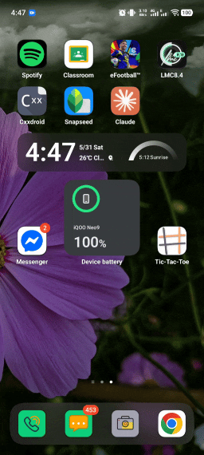

# Tic Tac Toe

A modern Tic Tac Toe game for Android, built with Kotlin and Jetpack Compose.

## Features

- Play against a friend or the bot (with difficulty levels)
- Emoji selector for player symbols
- Light and dark theme support
- Animated result popup
- Simple, clean UI

## Demo



## Getting Started

### Prerequisites

- Android Studio (Giraffe or newer recommended)
- Android SDK 24 or higher

### Build & Run

1. Clone the repository:
    ```sh
    git clone https://github.com/thehav0k/tic-tac-toe.git
    ```
2. Open the project in Android Studio.
3. Click **Run** to build and launch the app on an emulator or device.

## Project Structure

- `app/src/main/java/com/thehav0k/tic_tac_toe/` — Main source code
- `app/src/main/res/` — Resources (layouts, drawables, etc.)
- `app/build.gradle.kts` — App-level Gradle config

## Libraries Used

- [Jetpack Compose](https://developer.android.com/jetpack/compose)
- [Material 3](https://m3.material.io/)
- AndroidX Core, Lifecycle, Activity Compose

## License

This project is licensed under the MIT License.

---

Made by Md. Asif Khan
